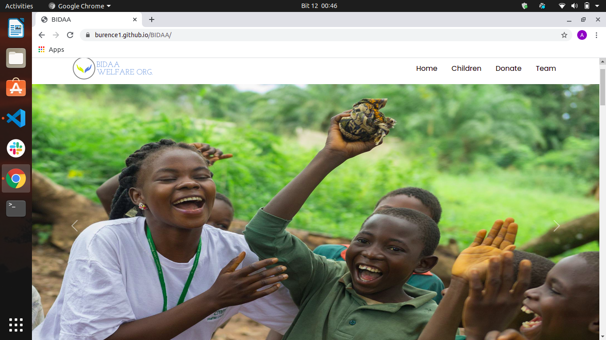

# BIDAA
<table>
<tr>
<td>
 BIDAA is a website for BIDAA welfare organization showcasing the the organizations work their accomplishments on how the have been able to change the lives if orphan's and street children. 
</td>
</tr>
</table>

## Demo
Here is a working live demo :  https://burence1.github.io/BIDAA/

### Landing Page
Heres is a screenshot of the landing page of BIDAA

## Mobile support
Although the website is compatible with devices of all sizes, we are still working on the responsitivity of some pages .

## [Demo](https://burence1.github.io/BIDAA/) 

### Development
To contribute, follow the following steps;

- Fork the repo
- Create a new branch (`git checkout -b 'contibution-branch'`)
- Make the appropriate changes in the files
- Add changes to reflect the changes made
- Commit your changes (`git commit -am 'contibution-branch'`)
- Push to the branch (`git push origin 'contibution-branch'`)
- Create a Pull Request 

## Built with 
- [Bootstrap](http://getbootstrap.com/) - Extensive list of Css components and  Bundled Javascript plugins.
- [javaScript]()
- [Html]() 
- [Css]() 

### Bugs
So far there are some errors on the website we have not rectified but it does not affect the functioning of the pages

# Team
<table>

<tr>
<td>

  
Burens Omondi
</td>

<td>

 
Ian Kiplagat
</td>

<td>

Savanah Agutu
</td>

<td>

 
Dennis Mulwa
</td>

<td>

 
Anzal Mohamed
</td>
</tr>

# License
[MIT](https://choosealicense.com/licenses/mit/) © [BIDAA Welfare Organization](https://github.com/Burence1/BIDAA)
